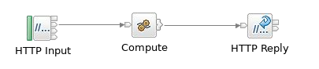
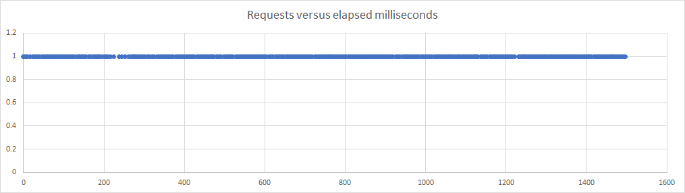
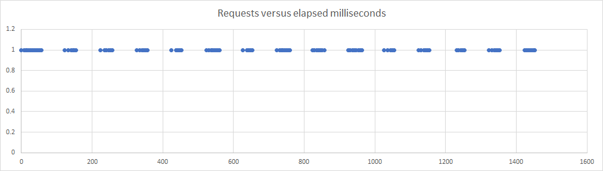
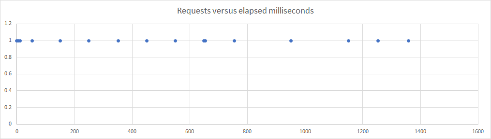

# ace-container-cpu

Experiments with CPU limiting using Docker and Kubernetes

## CPU limiting characteristics

The container CPU-limiting settings can be fractions, and a common setting
in the CP4i world is to set a 0.3 CPU limit for licensing reasons. While this
might be expected to make each message proceed through the system at 30% of
the normal speed, this is not actually what happens: the reality is that the
CPU is throttled once it reaches 30ms out of every 100ms, meaning that some
messages are delayed while others proceed at full speed.

## Demonstration flow and application

This repo contains an ACE application, a Dockerfile, and a Python script that
can be used to illustrate how CPU throttling works. The ACE application is
designed to burn CPU in a loop to simulate CPU-intensive activity in a flow, and
the Python script measures the amount of time taken by multiple requests. The
Dockerfile is used to create a container image that can be used to show the
results locally.



The important ESQL in the Compute node is as follows:
```
DECLARE iterations INTEGER 5000;
IF InputLocalEnvironment.HTTP.Input.QueryString.iterations IS NOT NULL THEN
	SET iterations = CAST(InputLocalEnvironment.HTTP.Input.QueryString.iterations AS INTEGER);
END IF;

DECLARE I INTEGER 0;
WHILE I < iterations DO
	SET OutputLocalEnvironment.a.b.c.d.e = 'dummy';
	SET OutputLocalEnvironment.a.b.c.d.e = NULL;
	SET I = I + 1;
END WHILE;
```
where the WHILE loop has no effect but does take time.

## Results

When the container is run with 1 CPU available, and the Python script is
used to check the times taken to process requests, the average in one example
(see the raw-data folder for the full set) for 100 requests is 5ms, while
with on 0.3 CPUs it was 14ms. So far, this seems reasonable, but when the
same test is run with 0.1 CPUs then the average time was 95ms, which is much
larger than expected, and a closer look at the data shows something more
than just a slow CPU.

### 1 CPU and 0.3 CPUs

Plotting the requests against time, where each dot represents a successful
request at a particular time, shows the following for 1 CPU:



which looks as smooth as expected, but the 0.3 CPU picture is very different:



and it is clear that what is happening is that the CPU is only available
for 30% of the time. When the CPU usage hits 30ms, the container is prevented
from running for the next 70ms, at which point the cycle begins again. This
can be seen in the entries printed out by the application, where a lot of the
times are the same as the 1 CPU data at around 5ms
```
26 Status code 200 time 5207306
31 Status code 200 time 5064695
36 Status code 200 time 4997000
41 Status code 200 time 4951787
```

but some are much larger
```
154 Status code 200 time 69835568
...
257 Status code 200 time 69930524
```

showing that those requests were caught in the CPU throttling.

### 0.1 CPUs

With only 0.1 CPUs available, the results are as follows:



and again some of the requests are the full-CPU 5ms
```
0 Status code 200 time 5789193
5 Status code 200 time 5422345
```

but now the gaps are larger and more frequent:
```
2255 Status code 200 time 98318129
2353 Status code 200 time 196952396
2550 Status code 200 time 199268113
2749 Status code 200 time 99944350
2849 Status code 200 time 100614267
```

showing that the requests are being throttled.

## Docker and Kubernetes

The results above used docker with the "--cpus" option, but the same effects
can be seen using Kubernetes. The extra layers of routes and services add some
overhead, but a fast-enough cluster can show the same effects. Slower clusters
make it much harder to see what is happening, as the "30ms out of 100ms" becomes
harder to spot if the network routing and HTTP processing becomes too large a
part of the overall time: CPU throttling is not triggered by IO activity.

## Artifacts

Assuming the ace-minimal images are available (see https://github.com/ot4i/ace-docker/tree/master/experimental/ace-minimal
for how to build them), then deploying the application via docker build
is relatively straightforward.
```
docker build --build-arg LICENSE=accept -t container-cpu:12.0.2.0-alpine .
```

Once the image is built, then it can be run with
```
docker run --cpus 0.3 --rm -ti -e LICENSE=accept -p 7800:7800 container-cpu:12.0.2.0-alpine
```
with the "--cpus" value being set to the desired value.

Once the application container is running, then the Python application can
be used to test the performance,
```
http-timing.py --url "http://localhost:7800/cpuBurnFlow" --iterations 5000
```

and the results validated.
